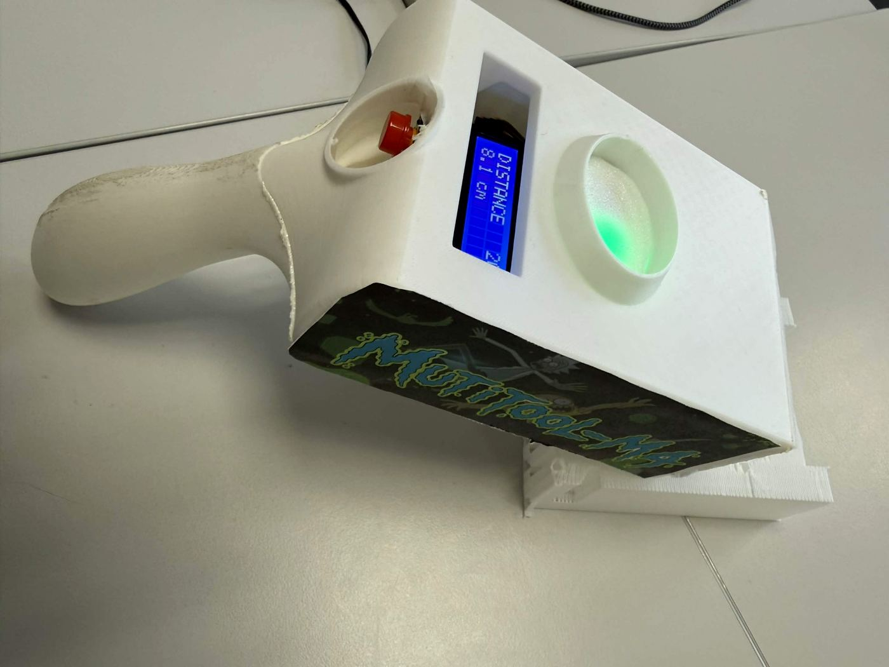
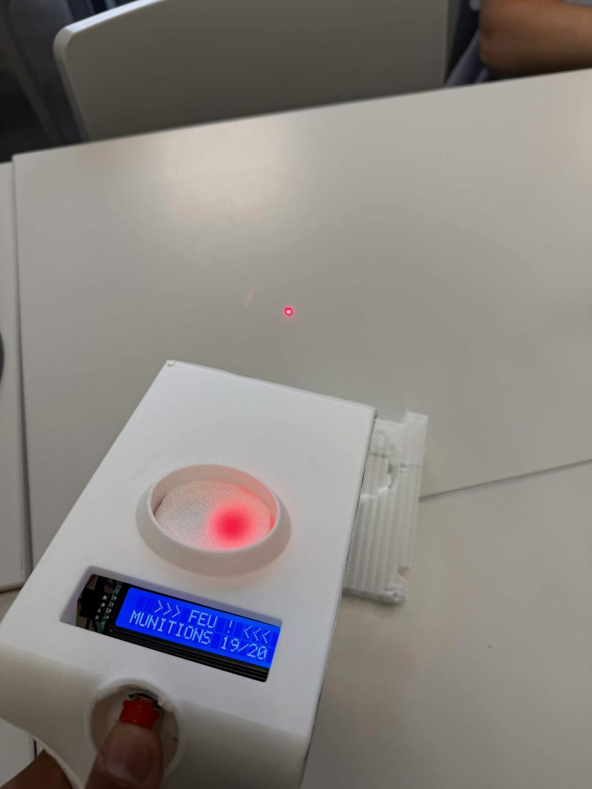
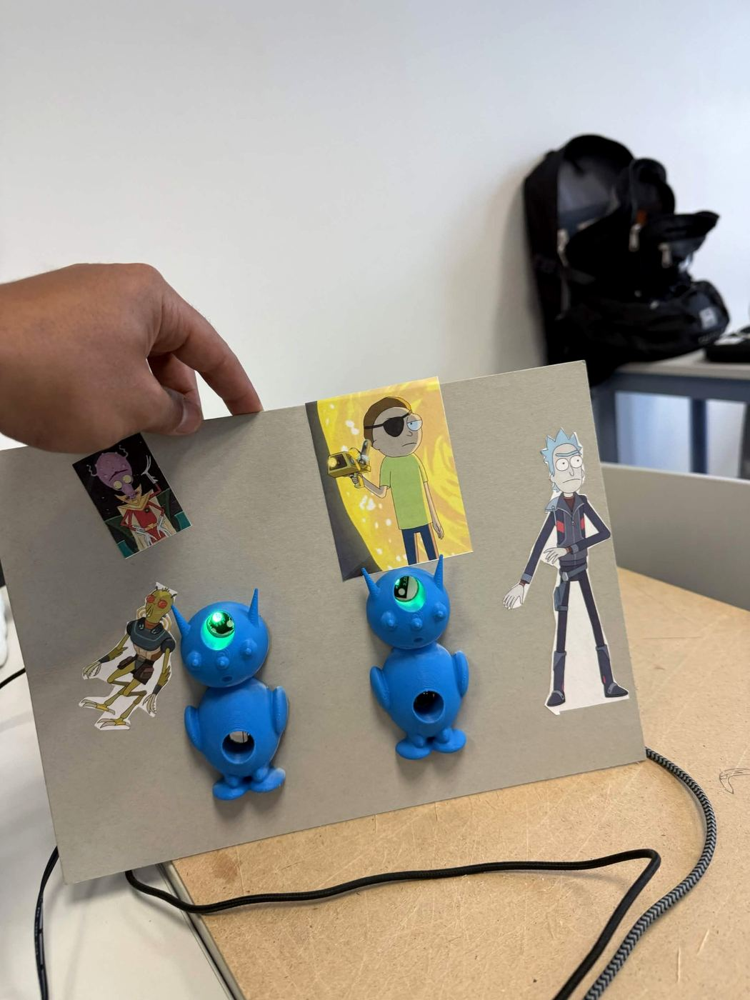
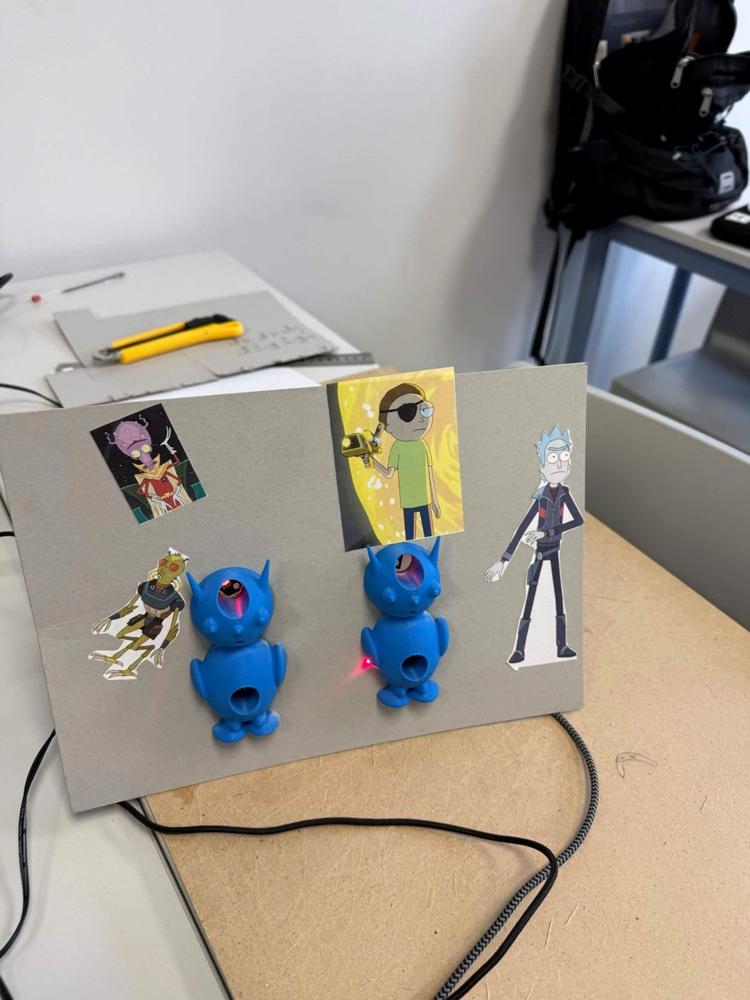

# Multitool-M4

Outil multifonction de mesure, de visée et de diagnostic, avec deux cibles réactives.  
Projet réalisé pendant le Workshop National B2 EPSI et myDiL, session de septembre 2026, thème RickLab.

**Groupe B2-3 :** Ivann Benini, Nicolas Lenois-Gelas, Jordy Rahantanirina, Noura Isaa.

---

## Le projet en deux phrases

Le Multitool-M4 est un outil multifonction inspiré de l’univers de Rick & Morty, regroupant plusieurs usages dans un seul boîtier contrôlé par un unique bouton. Le projet est complété par deux cibles réactives capables de détecter les tirs du laser.

---

## Aperçu du prototype

### Multitool-M4

<p align="center">
  
</p>

### Tir laser

<p align="center">
  
</p>

### Cibles réactives

<p align="center">
  
  
</p>

Les cibles sont vertes lorsqu’elles sont actives. Lorsqu’un récepteur détecte le laser, la cible concernée passe au rouge et déclenche un effet sonore avant de se réinitialiser automatiquement.

---

## Fonctionnalités

* Télémètre à ultrasons avec affichage en continu de la distance
* Pointeur laser avec charge progressive, accompagnée d’effets sonores et lumineux
* Mode rafale avec tirs laser par impulsions courtes
* Compteur de munitions avec système de recharge
* Analyseur de style générant un verdict aléatoire
* Mise en veille manuelle et automatique après une période d’inactivité
* Deux cibles réactives détectant les tirs, avec passage du vert au rouge et effet sonore lorsqu’elles sont touchées

---

## Architecture

Le système repose sur deux cartes NodeMCU ESP8266 indépendantes.

* **Carte 1, l'outil :** bouton, capteur à ultrasons HC-SR04, écran LCD 1602 en I2C, LED rouge et LED verte, buzzer, module laser
* **Carte 2, les cibles :** deux récepteurs laser, deux LED RGB, un buzzer partagé

Les deux cartes ne sont reliées par aucun fil et n'échangent aucune donnée. La seule information qui passe de l'une à l'autre est la lumière du laser. Aucun réseau, aucun serveur et aucun service en ligne ne sont utilisés, le Wi-Fi des cartes reste désactivé.

---

## Contenu du dépôt

```text
code/
  multitool_m4/     programme de la carte de l'outil
  cibles/           programme de la carte des deux cibles
modeles3d/          fichiers de la coque et des deux extraterrestres
docs/               dossier technique et fonctionnel, affiche
README.md
```

---

## Installation et mise en route

1. Installer l'IDE Arduino, puis ajouter le support des cartes ESP8266 par le gestionnaire de cartes.
2. Installer les bibliothèques `Wire` et `LiquidCrystal_I2C`.
3. Ouvrir `code/multitool_m4`, sélectionner la carte NodeMCU 1.0 et le bon port, puis téléverser.
4. Faire la même chose avec `code/cibles` sur la seconde carte.
5. Alimenter chaque carte par son propre câble USB. L'outil joue une animation de démarrage puis affiche `SYSTEME PRET`.

---

## Utilisation

Tout passe par le bouton unique.

| Geste sur le bouton | Fonction |
| --- | --- |
| Appui maintenu | Pointeur à charge, puis tir |
| 1 clic court puis appui maintenu | Mode rafale |
| 1 clic court seul | Analyseur de style, verdict positif |
| 2 clics courts | Analyseur de style, verdict négatif |
| 3 clics courts | Recharge du compteur |
| 4 clics courts | Mise en veille |
| Appui long pendant la veille | Réveil de l'outil |

L'écran rappelle en permanence le nombre de clics enregistrés et la fonction que le prochain geste va déclencher, donc il n'y a rien à retenir par cœur.

---

## Sécurité

Le laser ne doit jamais viser un visage, des yeux ou une surface réfléchissante. On vise uniquement les cibles prévues pour ça et on prévient les personnes présentes avant un tir.

---

## Fabrication

La coque de l'outil et les deux extraterrestres ont été modélisés sous Bambu Studio puis imprimés en 3D au myDiL. Les deux personnages sont collés sur un panneau en carton, la carte et le câblage sont fixés au dos du panneau, donc invisibles de face.

<p align="center">
  
</p>

<p align="center">
  
</p>

---

## Limites connues

* La liaison série de l'outil est inutilisable, la broche TX servant à la LED rouge
* Le capteur à ultrasons perd la mesure sur les surfaces molles et sur les angles
* Le récepteur des cibles est sensible à un éclairage direct dans son axe
* Le canal bleu des LED des cibles est câblé mais pas utilisé
* Il n'y a pas de comptage de points
* Le câblage reste sur platine d'essai à l'intérieur de la coque

---

## Pistes de suite

* Comptage de points et vrai mode de jeu chronométré
* Communication sans fil entre les deux cartes, par exemple en ESP-NOW, pour centraliser le score sur l'écran de l'outil
* Nouveaux outils dans le boîtier, la machine à états accepte des fonctions supplémentaires sans refonte
* Circuit soudé et batterie embarquée, pour se passer du câble USB

---

## Outils et ressources

### Logiciels et matériel

* **Arduino IDE** — programmation des cartes ESP8266
* **Bambu Studio** — modélisation 3D
* **BambuLab Studio** — préparation des impressions 3D
* **Imprimante 3D du myDiL** — fabrication de la coque et des cibles
* **Trello** — organisation et suivi des tâches
* **GitHub** — versionnement et partage du projet

### Ressources utilisées

Les documents fournis par les enseignants ainsi que l’assistant IA **Claude** ont été utilisés comme ressources pendant le workshop.

### Responsabilité du groupe

Le code et le fonctionnement du projet restent entièrement sous la responsabilité du groupe. Chaque membre est capable d’expliquer et de modifier les différents états, branchements et temporisations du système.
